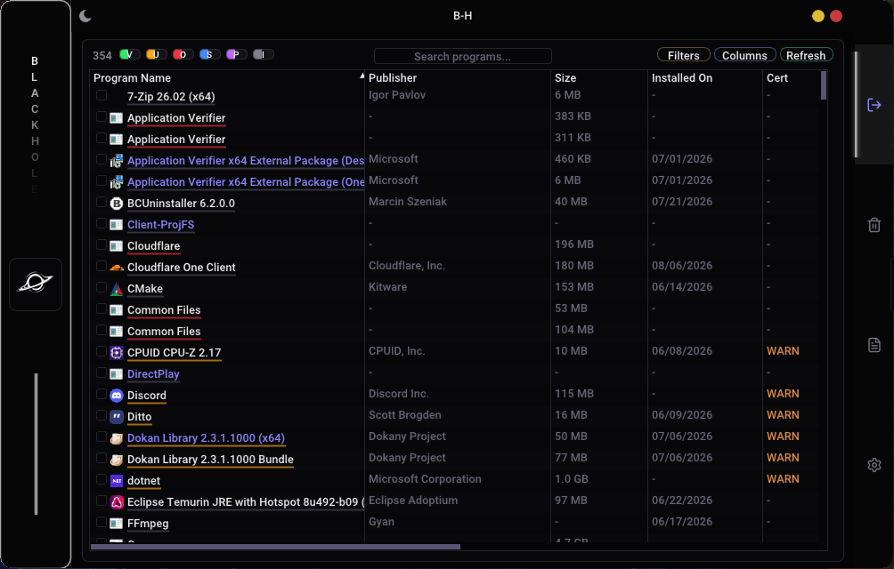
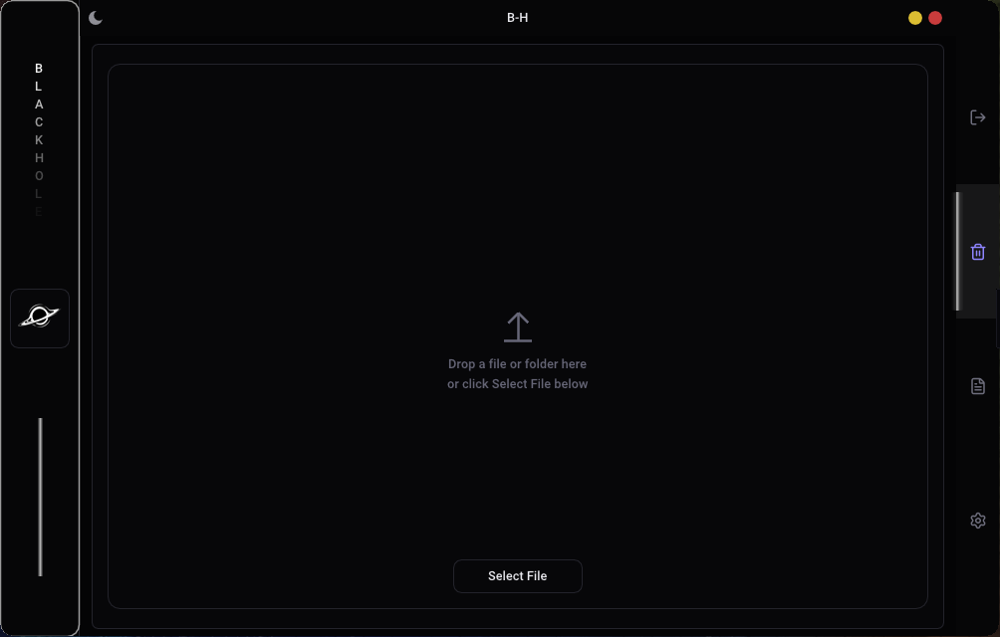
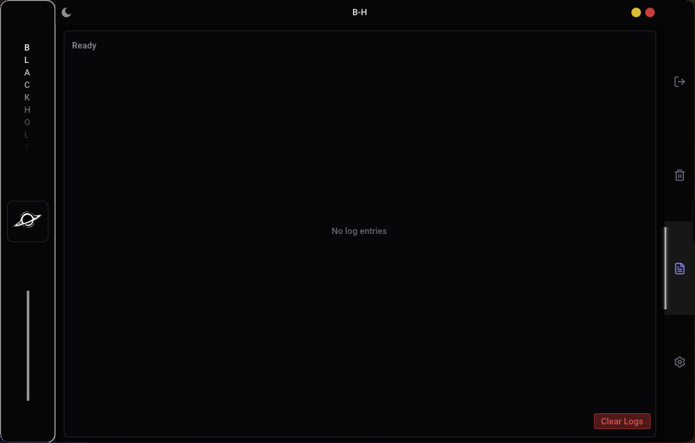
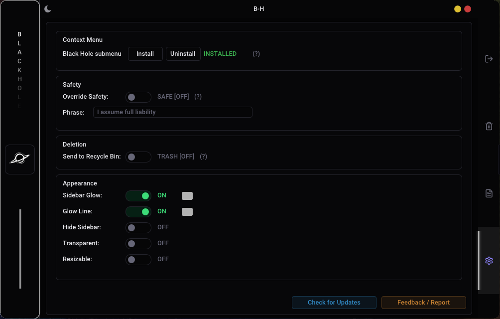

<p align="center">
  
  
  
  
</p>

<h1 align="center">Black Hole (B-H)</h1>

<p align="center">
  <strong>Windows system utility for safe deletion of locked, stubborn, and leftover files</strong>
</p>

<p align="center">
  <a href="https://github.com/axs-offcl/Black-Hole/releases/latest"><strong>Download Latest Release</strong></a>
  &nbsp;&middot;&nbsp;
  <a href="#features">Features</a>
  &nbsp;&middot;&nbsp;
  <a href="#cli-commands">CLI</a>
  &nbsp;&middot;&nbsp;
  <a href="#build-from-source">Build</a>
  &nbsp;&middot;&nbsp;
  <a href="#how-it-works">How It Works</a>
</p>

---

## What It Does

Black Hole is a Windows utility that deletes files standard methods can't handle -- locked executables, active DLLs, PPL-protected processes, and orphaned leftovers from uninstalled programs.

It uses the Win32 `MoveFileExW` reboot-queue mechanism to schedule deletion at the next reboot, when file locks are released. No kernel drivers, no shady hooks -- pure user-mode Win32 API.

---

## Screenshots

<p align="center">
  
</p>

<p align="center">
  
</p>

<p align="center">
  
</p>

<p align="center">
  
</p>

---

## Features

### File Deletion Engine

- **6-strategy deletion engine** -- tries the gentlest approach first, escalates only on failure:
  1. Atomic handle delete (`DELETE_ON_CLOSE` / POSIX delete via `NtSetInformationFile`)
  2. Direct `NtDeleteFile` (native NT API)
  3. Restart Manager shutdown (`RmStartSession` / `RmRegisterResources` / `RmShutdown`)
  4. Take ownership + strip attributes + delete
  5. Move to temp + delete (ADS cleanup)
  6. `MoveFileExW` reboot queue fallback
- **Batch deletion** -- single handle snapshot + single RM session for all files (2x faster than per-file)
- **Drag-and-drop** -- single file for instant analysis, or multiple files for batch deletion
- **Risk assessment** -- pre-deletion impact analysis with 0-100 risk score gauge
- **Expandable analysis cards** -- locked-by processes, dependent apps, registry refs, services, related files, leftovers
- **Recycle Bin mode** -- optional soft-delete with restore capability
- **Scheduled deletion queue** -- view and manage all pending reboot deletions
- **Reserved name handling** -- `CON`, `PRN`, `AUX`, `NUL`, `COM1`-`COM9`, `LPT1`-`LPT9`, ADS streams

### Program Uninstaller

- **Complete inventory** -- enumerates all installed programs from 3 registry hives (HKLM x86/64, HKCU)
- **3-phase progressive scan:**
  - Phase 1: Basic entry enumeration
  - Phase 2: Orphan detection + enrichment (PE metadata, icon loading, size calculation)
  - Phase 3: Extra scanners (services, COM, firewall, scheduled tasks, installer cache)
- **Multi-depth leftover scanning:**
  - **Safe** -- registry entries only (3 hives)
  - **Moderate** -- registry + file system traces + Start Menu + Desktop + App Paths + Run/RunOnce
  - **Advanced** -- + Services + COM objects + Firewall rules + Scheduled tasks + Installer caches + full Program Files
- **BCU-parity scanners** -- Chocolatey packages, Scoop apps, Windows Features, Windows Store apps, Windows Updates, MSI features
- **Multi-select batch uninstall** -- remove multiple programs at once with progress tracking
- **Batch leftover cleanup** -- scan all selected programs for remnants, purge with single click
- **Force Remove pipeline** -- kills locking processes, deletes files, purges registry entries
- **Standard uninstall** -- runs the program's built-in uninstaller
- **Leftover popup** -- displays detected remnants with confidence scoring, purge capability
- **Certificate verification** -- highlights unsigned executables with WARN label
- **PE metadata extraction** -- company name, file description, product name, version, bitness
- **Installer type detection** -- Msi, InnoSetup, NSIS, InstallShield, PowerShell, SdbInst
- **Cross-hive deduplication** -- merges entries appearing in multiple registry hives
- **Confidence scoring** -- each leftover rated Safe / Maybe / Risky with color-coded display
- **System Restore Point** -- optionally creates one before purging leftovers
- **Registry backup** -- exports keys to `%APPDATA%\BlackHole\RegistryBackups` before deletion

### Deep Scanners

#### Service Detail Scanner
- Binary paths, dependency chains, start types, running state
- Orphaned service detection (binary no longer exists)
- Protected service identification

#### COM/CLSID Scanner
- Deep enumeration of `HKCR\CLSID` entries
- InprocServer32 and LocalServer32 path extraction
- Cross-reference with installed programs

#### Firewall Rule Scanner
- Maps firewall rules to installed programs
- Identifies orphaned rules after uninstall

#### Scheduled Tasks Scanner
- Enumerates all scheduled tasks
- Maps tasks to installed programs
- Identifies orphaned tasks

#### Orphaned Installer Files Scanner
- Scans Windows Installer cache (`%WINDIR%\Installer`)
- Identifies orphaned `.msi`/`.msp` files
- Reports reclaimable disk space

#### Startup Entry Scanner
- Run/RunOnce keys (HKLM + HKCU)
- Startup Folder shortcuts
- Task Scheduler startup entries
- Service startup entries

#### WMI Scanner
- Event filter scanning (`__EventFilter`)
- Consumer scanning (`CommandLineEventConsumer`, `ActiveScriptEventConsumer`)
- Filter-to-consumer binding analysis
- Startup command scanning (`Win32_StartupCommand`)
- Threat assessment -- flags PowerShell, LOLBins, encoded commands, temp paths
- Malicious WMI subscription removal
- JSON/CSV export

#### Directory Orphan Scanner
- Scans Program Files and Program Files (x86) for orphaned folders
- Cross-references with installed program registry entries

### Process Killer (PPL)

- **PPL detection** -- identifies Protected Process Light status (Windows, LSA, Antimalware, Secured levels)
- **Multi-strategy termination** -- `NtTerminateProcess` -> Job Object -> WMI fallback chain
- **Debug privilege** -- acquires `SeDebugPrivilege` for maximum access
- **Critical process detection** -- prevents BSOD-causing kills (`csrss`, `smss`, `lsass`)
- **Process enumeration** -- find processes by name, by file lock, or list all protected processes
- **Batch termination** -- kill multiple PPL processes at once
- **Worker-threaded `GetFinalPathNameByHandleW`** -- 500ms timeout with `TerminateThread` fallback

### Context Menu (COM Shell Extension)

- **Force Delete** -- writes file list to temp, launches BlackHole for deletion
- **Force Delete and Scan** -- launches scan-and-delete for a single file
- **Analyze and Inspect** -- opens GUI with file pre-selected for analysis
- **Embedded DLL** -- shell extension DLL embedded as binary resource in the exe
- **Registry-based exe path** -- `HKCU\Software\BlackHole\ExePath` stores exe location
- **Auto-cleanup** -- removes 36+ old registry-based context menu entries on startup

### Safety System

- **Blacklist** -- 27+ critical system files permanently blocked from deletion:
  - Kernel: `ntoskrnl.exe`, `ntdll.dll`, `kernel32.dll`, `kernelbase.dll`, `hal.dll`
  - Boot: `bootmgr`, `winload.exe`, `winresume.exe`
  - Registry hives: `SYSTEM`, `SOFTWARE`, `SAM`, `SECURITY`, `DEFAULT`
  - System processes: `csrss.exe`, `wininit.exe`, `lsass.exe`, `services.exe`, `smss.exe`, `svchost.exe`, `explorer.exe`, `cmd.exe`, `powershell.exe`
  - Windows Defender directories
- **Uninstaller protection** -- 20 filesystem paths + 18 registry roots blocked from purge
- **Override** -- bypass requires typing `"I assume full liability"` (exact match, case-sensitive)
- **Override resets on restart** -- never persists across sessions
- **Audit logging** -- every operation logged to `%APPDATA%\BlackHole\audit.log` with JSON timestamps

### Export & Reporting

- **Multi-format export** -- HTML, CSV, or JSON reports from scan results
- **Styled HTML** -- dark-themed reports with color-coded status, responsive tables
- **Timestamped filenames** -- `BlackHole_Report_YYYYMMDD_HHMMSS.html`
- **UTF-8 with BOM** -- proper Unicode support for international characters

### Portable Mode

- **Auto-detection** -- if `config.ini` exists next to the exe, uses it instead of `%APPDATA%`
- **USB deployment** -- drop `config.ini` alongside `BlackHole.exe` and run from any drive
- **All settings preserved** -- theme, glow colors, transparency, sidebar state, deletion preferences

### GUI

- **Dear ImGui v1.92.9** with DirectX 11 hardware-accelerated rendering
- **Fully custom-drawn** -- no native widgets, everything rendered via `ImDrawList`
- **Frameless window** with custom title bar (minimize, maximize, close circles)
- **Dark / Light theme** -- full theme system with 10+ color constants
- **Custom color pickers** -- professional SV gradient + horizontal hue bar + hex input for sidebar glow and line glow
- **Lucide icon font** -- subset-embedded for navigation icons
- **Right dock navigation** -- 4-tab panel with rotating chevron toggle
- **Configurable sidebar** -- animated glow, collapsible, custom gradient text
- **Window transparency** -- adjustable alpha from 15% to 100%
- **Resizable mode** -- optional `WS_THICKFRAME` with min 600x400, max 1920x1080
- **Notifications** -- slide-in toasts with auto-dismiss and progress bars
- **System tray** -- minimize to tray, right-click context menu
- **Filter pills** -- color-coded capsule buttons for verification status filtering (Verified, Unverified, Orphaned, Store App, Update, Invalid)
- **Column chooser** -- 11 customizable columns for the uninstaller table
- **Filter chooser** -- 11 filter toggles (Microsoft, Portable, Store, System, Updates, Protected, Orphans, Chocolatey, Scoop, Tweaks, Unregistered)
- **Properties modal** -- right-click properties view for uninstall entries
- **Process kill dialog** -- shows locking processes with options to terminate
- **Search bar** -- real-time filtering of installed programs

### CLI Commands

```bash
# Headless deletion (shows toast notification, writes to audit.log)
BlackHole.exe --delete "C:\path\to\file"

# Batch deletion from text file (one path per line)
BlackHole.exe --delete-list "C:\path\to\filelist.txt"

# Opens standalone ScanDeletePopup window for a single file
BlackHole.exe --scan-and-delete "C:\path\to\file"

# Open GUI with file pre-selected and auto-analysis started
BlackHole.exe --analyze "C:\path\to\file"
```

| Command | Description | UI |
|---------|-------------|-----|
| `--delete <path>` | Headless single-file deletion | Toast notification |
| `--delete-list <path>` | Batch delete from text file (one path per line) | Toast notification |
| `--scan-and-delete <path>` | Scan for locks, then delete with confirmation | Standalone popup window |
| `--analyze <path>` | Open GUI with file pre-selected, auto-analysis | Main GUI window |

### Additional

- **Crash handler** -- `SetUnhandledExceptionFilter` + `std::terminate` handler, full register state dump, stack trace via `StackWalk64` + `SymFromAddr`, writes to `%TEMP%\BlackHole_crash.log`
- **Update checker** -- queries GitHub API for latest release, downloads and launches installer
- **Config persistence** -- saves preferences to `%APPDATA%\BlackHole\config.ini` (or exe directory for portable mode)
- **Icon caching** -- LRU memory + on-disk cache (`%APPDATA%\BlackHole\IconCache`, max 2000 entries)
- **Embedded font** -- Roboto-Medium (162KB) included in the binary
- **Embedded Lucide icons** -- subset-embedded icon font (ISC license)
- **Embedded shell extension DLL** -- `BlackHoleShell.dll` embedded as binary resource, extracted at runtime

---

## Getting Started

### Download

**Option 1: Portable (single exe)**
Grab `BlackHole.exe` from [Releases](https://github.com/axs-offcl/Black-Hole/releases/latest). Single exe, no installer needed.

**Option 2: NSIS Installer**
Run the NSIS installer from [Releases](https://github.com/axs-offcl/Black-Hole/releases/latest). Installs to Program Files, adds Start Menu shortcut, registers context menu.

Both require Administrator privileges (UAC manifest embedded as `asInvoker` with runtime self-elevation).

### Build from Source

**Requirements:**
- Windows 10/11 (x64)
- Visual Studio 2022 BuildTools or full IDE with MSVC v143+
- CMake 3.15+
- Windows SDK 10.0+

```bash
git clone https://github.com/axs-offcl/Black-Hole.git
cd Black-Hole
cmake -B build -G "Visual Studio 17 2022" -A x64
cmake --build build --config Release
```

Output: `build/bin/Release/BlackHole.exe`

> **Note:** Dear ImGui v1.92.9 is fetched automatically via CMake `FetchContent`. No vendored dependencies needed.

### Run Tests

```bash
build/tests/Release/BlackHoleTests.exe
```

119 unit tests covering blacklist logic, file deletion strategies, privilege management, audit logging, protected deletion, and uninstaller parsing.

---

## How It Works

### Deletion Strategy

```
1. Atomic Handle     Open file with DELETE_ON_CLOSE / POSIX delete
2. Direct Delete     NtDeleteFile (native NT API)
3. Restart Manager   RmStartSession -> RmRegisterResources -> RmShutdown
4. Take Ownership    Set owner to Administrators, strip ReadOnly/Hidden/System
5. Move + Delete     Move to temp directory, clean alternate data streams
6. Reboot Queue      MoveFileExW(MOVEFILE_DELAY_UNTIL_REBOOT)
```

Each step only runs if the previous one fails. Batch deletion uses a single handle snapshot + single RM session for all files (2x faster than per-file approach).

### Impact Analysis

Before deletion, the impact analyzer scores risk (0-100) based on:
- Process lock count, dependent app count, registry references
- Service dependencies, system file status, digital signature
- Related file count, leftover count after deletion

### Privilege Management

Runs with `asInvoker` UAC manifest. Self-elevates to Administrator at runtime via `ShellExecuteExW("runas")` when elevated privileges are needed. CLI commands (`--delete`, `--delete-list`, `--scan-and-delete`) skip self-elevation for headless operation.

---

## Project Structure

```
BlackHole/
├── src/
│   ├── gui_imgui.cpp              # Main GUI (Dear ImGui + DX11, ~6500 lines)
│   ├── uninstaller.cpp            # Program enumeration + leftover scanning (~6200 lines)
│   ├── deletor.cpp                # 6-strategy file deletion engine (~1900 lines)
│   ├── blacklist.cpp              # 27+ critical file protection
│   ├── privilege.cpp              # UAC privilege escalation
│   ├── logger.cpp                 # JSON audit logging
│   ├── impact_analyzer.cpp        # Pre-deletion risk assessment
│   ├── ppl_killer.cpp             # PPL process termination (Nt/Job/WMI)
│   ├── wmi_scanner.cpp            # WMI persistence scanner
│   ├── report_exporter.cpp        # HTML/CSV/JSON export
│   ├── scheduled_queue.cpp        # Pending reboot deletion queue
│   ├── context_menu.cpp           # Old context menu cleanup + registry ops
│   ├── shell_ext.cpp              # COM shell extension DLL (IContextMenu)
│   ├── scan_delete_popup.cpp      # Standalone scan-and-delete window
│   ├── bg_workers.cpp             # Background thread workers
│   ├── app_config.cpp             # Config save/load (INI format)
│   ├── app_util.cpp               # String conversion utilities
│   ├── crash_handler.cpp          # Crash handler (SEH + std::terminate)
│   ├── deletion_engine.cpp        # Deletion engine helpers
│   ├── process_util.cpp           # Process enumeration utilities
│   ├── icon_manager.cpp           # Icon caching (LRU memory + disk)
│   ├── toggle_window.cpp          # Dock toggle button rendering
│   └── tests/                     # 119 unit tests
├── include/
│   ├── embedded_font.h            # Roboto-Medium (162KB, embedded)
│   ├── embedded_lucide.h          # Lucide icons (776KB, subset-embedded)
│   ├── embedded_shell_dll.h       # BlackHoleShell.dll (binary resource)
│   └── *.h                        # Module headers
├── resources/
│   ├── BlackHole.manifest         # UAC asInvoker
│   ├── BlackHole.rc               # Version resource + icons
│   ├── icon.ico                   # Application icon (270KB, 6 sizes)
│   ├── icon_delete.ico            # Context menu icon
│   ├── icon_scan.ico              # Context menu icon
│   └── icon_analyze.ico           # Context menu icon
├── tests/
│   └── integration_tests.cpp      # Integration tests
├── installer/
│   └── BlackHole.nsi              # NSIS installer script
└── CMakeLists.txt                 # Build configuration
```

---

## Tech Stack

| Layer | Technology |
|-------|-----------|
| Language | C++17 (MSVC v143+) |
| GUI | [Dear ImGui](https://github.com/ocornut/imgui) v1.92.9 WIP + DirectX 11 |
| Icons | [Lucide](https://lucide.dev) (subset-embedded, ISC license) |
| Font | Roboto-Medium (embedded) |
| Build | CMake 3.15+ + FetchContent |
| API | Raw Win32 (kernel32, advapi32, shell32, ntdll, psapi, shlwapi, rstrtmgr, wintrust, dwmapi, wbemuuid) |
| Process Killer | `NtTerminateProcess` + Job Object + WMI fallback |
| WMI | COM/IWbemServices |
| Service SCM | Win32 Service Control Manager API |
| Deletion | `MoveFileExW` reboot queue + Restart Manager |
| Shell Extension | COM `IContextMenu` + `IShellExtInit` |
| Logging | JSON to `%APPDATA%\BlackHole\audit.log` |
| Config | INI-style `%APPDATA%\BlackHole\config.ini` (portable: exe directory) |

---

## Configuration

All settings are saved to `%APPDATA%\BlackHole\config.ini` (or next to the exe in portable mode):

| Key | Type | Default | Description |
|-----|------|---------|-------------|
| `DarkMode` | bool | `1` | Dark theme enabled |
| `SendToRecycleBin` | bool | `0` | Soft-delete to Recycle Bin |
| `CreateRestorePoint` | bool | `0` | Create restore point before purge |
| `SidebarGlowEnabled` | bool | `1` | Sidebar glow animation |
| `SidebarGlowR/G/B` | float | `0.2/0.9/0.4` | Sidebar glow color (0-1) |
| `LineGlowEnabled` | bool | `1` | Line glow between elements |
| `LineGlowR/G/B` | float | `0.2/0.9/0.4` | Line glow color (0-1) |
| `HideSidebar` | bool | `0` | Sidebar collapsed |
| `HideDock` | bool | `0` | Dock panel hidden |
| `WindowTransparent` | bool | `0` | Transparency enabled |
| `WindowAlpha` | float | `1.0` | Window opacity (0.15-1.0) |
| `ResizableWindow` | bool | `0` | Resizable window mode |
| `DockExpanded` | bool | `1` | Dock panel expanded |

---

## License

Distributed under the GNU General Public License v3.0. See `LICENSE` for details.

---

<p align="center">
  Built with Win32 API + Dear ImGui + DirectX 11
</p>
